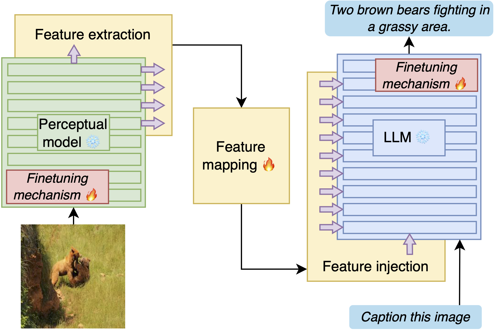
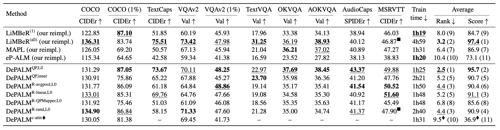
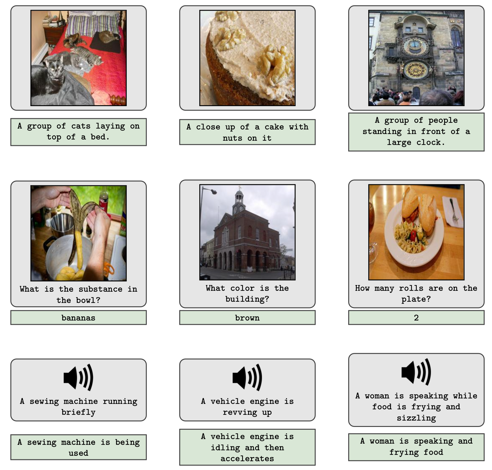

# DePALM: Improved Baselines for Data-efficient Perceptual Augmentation of LLMs

Code accompanying our paper ["Improved Baselines for Data-efficient Perceptual Augmentation of LLMs"](https://arxiv.org/abs/2403.13499).


## Introduction

*The abilities of large language models (LLMs) have recently progressed to unprecedented levels, paving the way to novel applications in a wide variety of areas.
In computer vision, LLMs can be used to prime vision-language tasks such image captioning and visual question answering when coupled with pre-trained vision backbones.
While different approaches have been explored to interface LLMs with ``perceptual backbones'' that process, e.g., visual or audio data, they are often explored for different tasks, different datasets, and using different perceptual backbones and language models, hindering direct comparison of the interfacing mechanisms.
To remedy this lack of comparability between methods,
we present an extensive experimental evaluation of different interfacing mechanisms, across multiple tasks (including image, video, and audio captioning as well as visual question answering), datasets and backbones, paying special attention to low-data settings.
We find improved performance using existing mechanisms over state-of-the-art results, and identify a new interfacing mechanism that yields (near) optimal results across different tasks, while obtaining  a $4\times$ reduction in training time.*


<center></center>

### Results

<center></center>

> Comparison of our proposed DePALM architectures and our baseline re-implementations, after training on 100\% or 1\% on each datasets. We highlight the **<u>first</u>**, **second** and <u>third</u> best results. All results are averaged on 5 runs.
> We show the **training time** on AudioCaps, the average rank and average normalized score of each method across benchmarks. For these last two values, we add the rank over all our models.
> $\blacksquare$: tokens are first averaged across time to prevent memory errors.
> $\blacklozenge$: incomplete data (unstable training).

<center></center>

> Qualitative samples of DePALM on the COCO (first row), VQAv2 (second row) and AudioCaps (third row) datasets, when finetuned on 100\% of the data. (Multimodal) input is in gray, and output is in green. For the audio inputs, a ground-truth caption of the input audio is shown instead.

## Installation

### Requirements

You need `conda` and `java` on your system (JDK version: between 8 and 13).
If you have a non-standard installation path, please change the value of `JAVA_PATH` in the file `cccpaths.py`.

### Installation process

First, clone the repository, move in it, and create the conda environment :

```bash
git clone <depalm-repository-url>
cd depalm
conda env create -f environment.yml
conda activate depalm
```

If you don't want to use a gpu, use the following conda commands instead. It is only supported for testing purposes, as the training will be too slow.

```bash
conda env create -f environment-cpu.yml
conda activate depalm-cpu
```

### Downloading datasets and models

To download the data, you first need to set the HUGGINGFACE_TOKEN environment variable with one of your [security tokens](https://huggingface.co/docs/hub/security-tokens) to be able to access gated models. Then, launch the `download-data.sh` script:

```bash
export HUGGINGFACE_TOKEN="<put your token here>"
sh download-data.sh
```

If you already have some datasets stored locally, you can remove them from the `download-data.sh` script, and change the paths in the configurations files (`config/dataset`) to point to your copy. Please check they follow the same file architecture.

### Troubleshooting installation

The laion_clap module may have a conflict with the `training` dependency, becaus of how its code is written. To solve this, you will have to edit files manually. Replace occurences of `from training.data` by `from .training.data` in `<PYTHON_LIB_PATH>/laion_clap/hook.py`. To find this file, run `echo "$CONDA_PREFIX/lib/python3.10/site-packages/laion_clap/hook.py"`.

To use videos, you also need to install the decord package using pip, or from source (https://github.com/dmlc/decord). On MacOS arm64, you need to install it from source.

## Running experiments

DePALM can be run by launching the `run.py` script. Its configuration is stored into the `yaml` files in `config/`. The default configuration is stored `run.yaml`, and can be changed by passing command-line arguments. For more details about the command arguments syntax, see the [hydra documentation](https://hydra.cc/). The command below run a sample experiment.

```bash
python run.py run_dir="outputs/expe_1" dataset=coco experiment=depalm_l0 seed=0
```

### Experiment scripts

We include in the `experiments/` directory the commands to run all main experiments on all our benchmarks, including some variations with 1% of data or with bias fine-tuning of the feature model. You can call these scripts from a slurm job, or directly from your command-line. They all use the default seed (0).

```bash
sh experiments/coco_100%/coco_100%_depalm-c-attn_eva-clip-L.sh
```

### Using slurm / running on a cluster

DePALM can be run on a single cluster node, and will use all available GPUs automatically, processing the data in parallel between the nodes. Please be aware that the effective batch size will be the batch size in the configuration multiplied by the number of GPUs. To properly run experiment, write a slurm script launching the `run.py` python file, with a `run_dir` argument based on the slurm job id.


### Arguments

All the argument can be found inside the configuration files. Below are detailed the most commonly overwritten ones. Head to `run.yaml` and the other files for a complete list.

- `run_dir` defines the directory where the log and checkpoint files will be stored. Don't use the same one for multiple runs, as it will mix with or erase the previous data.
- `seed` defines the seed for the random generator, to enable reproducible experiments. In our experiments, we use the value `0,1,2,3,4` or `0,1,2` depending on the number of runs.
- `dataset` selects the benchmark used, between the configuration files stored in `config/dataset`. Admissible values are:
    - Image datasets: `coco`, `textcaps`, `vqa`, `okvqa`, `aokvqa`, `text_vqa`
    - Audio dataset: `audiocaps`
    - Video dataset: `msrvtt`
- `experiment` and `mod` can be used to select the architecture variant. Below are the arguments for all models in the paper:
    - Baseline reproductions:
        - `experiment=mapl` (**MAPL**)
        - `experiment=limber` (**LiMBeR (all)**),
        - `experiment=limber adapter.source.keep_features.n_elements=1` (**LiMBeR (1)**),
        - `experiment=epalm_opt` (original **eP-ALM**, with the OPT model),
        - `experiment=epalm` (our best version of **eP-ALM**),
    - DePALM variants:
        - `experiment=depalm +mod=insert_l0` (**QP,L0**),
        - `experiment=depalm` (**QP,inner**),
        - `experiment=depalm_resampler resampler.type=avg_pool adapter.embed_dim=llm_dim` (**R-avgpool,L0**),
        - `experiment=depalm_resampler resampler.type=linear adapter.embed_dim=llm_dim` (**R-linear,L0**),
        - `experiment=depalm_resampler resampler.type=qpmapper adapter.embed_dim=768` (**R-QPMapper,L0**),
        - `experiment=depalm_resampler resampler.type=rand_any_patch resampler.reduction_fact=1 adapter.embed_dim=auto` (**R-rand,L0**),
        - `experiment=depalm_inner mod=cross_attn` (**c-attn**)
- `feat_model` sets the feature extractor. Available models:
    - Image models: - ast
`clip-vit-B-laion`, `clip-vit-B`, `clip-vit-L-laion`, `clip-vit-L`, `dinov2-B`, `dinov2-G`, `dinov2-L`, `dinov2-S`, `eva-clip-L`, `vit-B-in1k`, `vit-B-in21k_ft1k`, `vit-B-in21k`, `vit-L-in21k_ft1k`
    - Audio models: `ast`, `clap`, `mavil` (currently unavailable as [MAViL code](https://github.com/facebookresearch/MAViL/tree/main) is not yet released)
    - Video models: `timesformer`, `timesformer_avg`
    - Disabling features: `disabled`
- `llm` select the frozen text model used for the experiment. The default value is `llama`.
    - LlaMA variants: `llm=llama`, `llm=alpaca`, `llm=llama2`, `llm=llama2-chat`
    - OPT variants: `llm=opt`. The default one is the 6.7B model, but can be changed by setting `llm.name="facebook/opt-125m"` (replace 125m by the OPT size).
- On smaller datasets, the number of layers of the adapter can be changed using `adapter.transformer.n_layers=1`, and the embedding dimension with `adapter.embed_dim=768`.
- Training arguments:
    - Learning rate: `training.optimizer.args.lr=1e-3`
    - Changing the batch size: `dataset.splits.train.batch_size=4` (default: 16)
    - Changing the number of epochs: `training.epochs=20` (default: 8)
    - Increasing the batch size with gradient accumulation: `training.accumulate_steps=4` (default: 1)
    - Stabilizing training with gradient clipping: `training.clip_norm=0.2`
- Additional fine-tuning:
    - bias tuning of the features model: `finetune.feat_model.bias_tuning.enable=true`
    - bias tuning of the LLM: `finetune.feat_model.text_model.enable=true`
    - disabling prompt tuning: `finetune.prompt_tuning.enable=true`
- Training on partial data:
    - `dataset.splits.train.max_rows=0.1` to train on 10% data (syntax for values between 0 and 1, excluded)
    - `dataset.splits.train.max_rows=0.01` to train on 1% data
    - `dataset.splits.train.max_rows=512` to train on only 512 rows (syntax for all integer values)
    - `dataset.splits.test.max_rows` and `dataset.splits.val.max_rows` can be set similarly if required
- Evaluation
    - `load_model=/absolute/path/to/your/model/weights.pth` to load from a checkpoint
    - `test=true` to evaluate the model on the test split (or the validation split if this is the one used on the benchmark, i.e. when `test_on_train=true`).

## Citing DePALM

If you use DePALM in a research work please cite [our paper](https://arxiv.org/abs/2403.13499):

```latex
@article{Vallaeys2024ImprovedBF,
  title={Improved Baselines for Data-efficient Perceptual Augmentation of LLMs},
  author={Th'eophane Vallaeys and Mustafa Shukor and Matthieu Cord and Jakob Verbeek},
  journal={arXiv:2403.13499},
}
```

## License

DePALM is licenced under CC-BY-NC, please refer to the [LICENSE](LICENSE) file in the top level directory.

Copyright © Meta Platforms, Inc. See the [Terms of Use](https://opensource.fb.com/legal/terms/) and [Privacy Policy](https://opensource.fb.com/legal/privacy/) for this project.